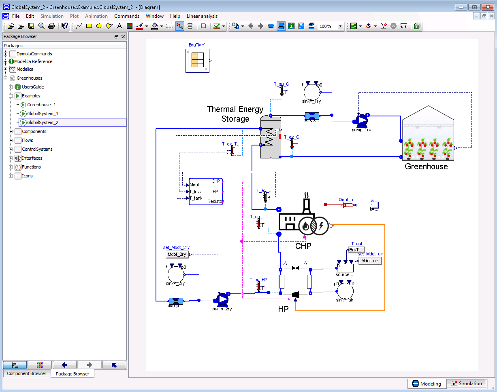
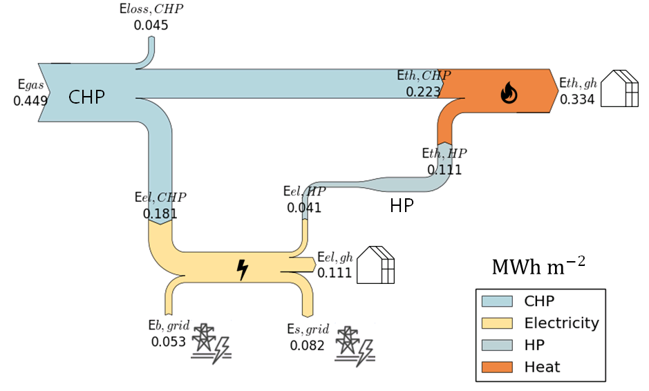

.. _examples:

Examples
========

Greenhouse_1
------------

This example intends to illustrate the simulation of the climate in a greenhouse. The greenhouse model is built by connecting all the greenhouse components to the energy and mass flows presents in a greenhouse. As it can be distinguished, the greenhouse modeled in this example consists of two levels of heating circuits, roof windows (but not side vents), natural ventilation (no forced ventilation) and a movable thermal screen. It should be noted that, when the screen is drawn, the air of the greenhouse is divided in two zones, i.e. below and above the screen. These zones are modeled separately (models *air* and *air_Top*) and their climate is assumed to be homogeneous. The models parameters have been set to typical values for Venlo-type greenhouse construction design dedicated to tomato crop cultivation. The greenhouse floor area and the mean greenhouse height are set in two individual block sources.

The simulated greenhouse is located in Belgium and the simulation period is from the 10th of December to the 22nd of November. Two input data files are required:

- *Weather data*: The input weather data for the simulation period is extracted from a TMY for Brussels and can be found in 'Greenhouses/Resources/Data/10Dec-22Nov.txt'. The file contains data for the outside air temperature, air pressure, wind speed and global irradiation. The sky temperature, previously computed in a Python script, is also included in this file.
- *Climate control set-points*: The temperature and |CO2| set-points for the simulation period are calculated according to the strategy presented in :ref:`control` and can be found in 'Greenhouses/Resources/Data/SP_10Dec-22Nov.txt'.

These *.txt* files are accessed by means of *TMY_and_control* and *SP_new*, which are two *CombiTimeTables* models from the Modelica Standard Library.

The goal of this example is to show the energy flows interacting in a greenhouse. Thus, no generation units are included. Instead, the heating pipes are connected to a water source and sink model. The model includes the following controls:

- *PID_Mdot*: A PI controller adjusts the output mass flow rate of the water source connected to the heating pipes by compaing the air temperature set-point and present value. 
- *PID_CO2*: A PI controller adjusts the output of the |CO2| external source by comparing the actual |CO2| concentration of the air to its set-point.
- *Ctrl_SC*: A state graph adjusts the screen closure (SC) according to the strategy presented in :ref:`control`. The real inputs must be connected to the air relative humidity, the outdoor temperature, the indoor air temperature set-point and the usable hours of the screen. The usable hours are 1h30 before dusk, 1h30 after dawn and during night. In the global he global outside irradiation
- *vents*: A PI controller adjusts the opening of the windows according to the strategy presented in :ref:`control`. The opening depends mainly on the indoor air relative humidity and temperature. 
- *OnOff*: controls the ON/OFF operation of the supplementary lighting according to the strategy presented in :ref:`control`. The control output, previously computed in a Python script, is input as a *.txt* file by means of the *TMY_and_control* model.

.. figure:: figures/example1.png
	:figclass: align-center

GlobalSystem_1
--------------
This example illustrates the energy flows of a greenhouse connected to a CHP unit and a thermal storage tank. The storage tank is connected as an open buffer, i.e. the CHP is not directly connected to the greenhouse but only to the buffer. The greenhouse is modeled by the ready-to-use greenhouse model included in *Greenhouse/Unit* sub-package, in which the parameters are already set to typical values for Venlo-type greenhouse construction design dedicated to tomato crop cultivation. The CHP unit is sized to provide the peak load of the thermal demand of the greenhouse, which can be extracted from the example *Greenhouse_1*. The thermal energy storage unit is sized considering a storage period of 8h and given a nominal temperature difference (:math:`\Delta T`) between the inlet and the outlet.

The CHP consumes natural gas and is providing the heating and electrical demand of the greenhouse. A heat-driven control decides when to run the CHP unit depending on the greenhouse demand and the storage level. The limited electrical load of greenhouses implies an excess in electricity generation when using CHP units, which have a power-to-heat ratio usually close to one. In this example, the excess of electricity is sold back to the grid. Since the control is heat-driven and there is no electrical storage, it is possible that at some points there is electrical demand but the CHP is not running. At this moment, electricity is bought from the grid. The buying and selling prices of electricity, as well as the buying price of gas, are considered constant during the whole simulation. The difference between the buying and selling prices of electricity occurs because, in the absence of subsidies, the electricity excess fed to the grid is remunerated at a price close to the wholesale price of electricity, which is much lower than the retail price (i.e. buying price).

.. figure:: figures/example2.png
	:figclass: align-center

The following sankey diagram illustrates the total production and consumption of the CHP and the greenhouse over the simulation period. The values are in :math:`MWh m^{-2}`, and they include: the total CHP consumption of gas (:math:`E_{gas}`), the CHP thermal production (:math:`E_{th,CHP}`), electrical production (:math:`E_{el,CHP}`) and losses (:math:`E_{loss,CHP}`); the greenhouse thermal demand (:math:`E_{th,gh}`) and electrical demand (:math:`E_{el,gh}`); and the electricity bought (:math:`E_{b,grid}`) and sold back (:math:`E_{s,grid}`) to the grid.

.. figure:: figures/results1.png
	:figclass: align-center
	:scale: 60%

GlobalSystem_2
--------------
In the previous example *GlobalSystem_1*, a considerable part of the produced electricity is sold back to the grid. As explained, this electricity, in the absence of subsidies, is remunerated at a price close to the wholesale price of electricity. Because the retail price of electricity is significantly higher than wholesale price, prosumers have a clear advantage at maximizing their level of self-consumption :cite:`quoilin_quantifying_2016`. In order to evaluate the potential of such activity and to illustrate the use of the library, a third simulation is developed. In this example, the particular case of maximizing the self-consumption level of the system simulated in *GlobalSystem_1* is evaluated. To that end, a heat pump is added to the system. The heating demand of the greenhouse is produced by both the heat pump and the CHP. Therefore, the CHP capacity is reduced, and the heat pump is sized so that its nominal electrical capacity is equal to the excess of electricity production of the CHP in nominal conditions. Similarly than in *GlobalSystem_1*, a heat-driven control decides when to run the CHP and the heat pump. Electricity excess not consumed by the heat pump is sold to the grid. The greenhouse electrical demand not covered by the CHP is covered by the grid. The electricity and gas prices are the same than in *GlobalSystem_1*.

Similarly than for *GlobalSystem_1*, the total consumption and production of the system over the simulation period is illustrated in the following sankey diagram. In this diagram the electrical  consumption (:math:`E_{el,HP}`) and thermal production (:math:`E_{th,HP}`) of the heat pump are also indicated. 

A detailed comparison of the results obtained by *GlobalSystem_1* and *GlobalSystem_2* is presented in :cite:`altes-buch_modeling_2018`. Because of the lower CHP capacity, the gas consumption is lower in *GlobalSystem_2* than in case *GlobalSystem_1*. In a similar way, the total net electrical generation of case *GlobalSystem_2* is also lower. As expected, the heat pump reduces the amount the electricity sold back to the grid.   

.. |CO2| replace:: CO\ :sub:`2`

