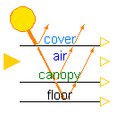
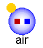
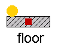
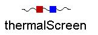
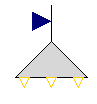
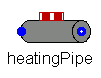

.. _greenhouse:

Greenhouse
==========

The *Greenhouse* sub-package include models of the different greenhouse elements at which the energy and mass balances are performed to compute all the state variables (temperature, vapor pressure of water and |CO2| concentration) of these elements. 
These are the main and top air zones, the canopy, the cover, the floor and the thermal screen. For a given component, the energy balance is done by taking into account all the heat flows that are connected to the heat port (i.e. conduction, convection and/or long-wave radiation), the latent heat of the vapor flows connected to the vapor mass port and the forced short-wave radiation input connected to the short-wave radiation flow connector. The computation of the heat and vapor flows is done in individual models, described in the :ref:`flows` section. Since no spatial differences in temperature, vapor pressure of water and |CO2| concentration are considered, all the model flows are described per square meter of greenhouse floor. 

Except for the cover model, since the short-wave radiation can origin from two sources (the sun and supplementary  illumination), the short-wave radiation input has the form of a vector. The parameter N\ :sub:`rad` \ defines the dimension of the vector and depending on whether or not the greenhouse has supplementary lighting, the user can set it to two or one, respectively. The computation of the absorbed short-wave radiation flows is done in the *Solar_model* and the *Illumination* model, according to the provenance of the flow.

The *Greenhouse* sub-package also includes an already-build greenhouse model ready to use.

General nomenclature
^^^^^^^^^^^^^^^^^^^^

Subscripts
----------

.. table::

	===============	===========================================================================
	Name            Description
	===============	===========================================================================
	Air		Greenhouse main air zone
	Can		Canopy
	cnd		Conduction
	cnv		Convection
	Cov		Cover
	Ext		External source of CO\ :sub:`2`\
	Flr		Floor
	Glob		Global radiation
	Ilu		Supplementary lighting
	lat		Latent heat
	Out		Outside air
	Pipe		Pipe heating system
	rad		Long-wave infrared radiation
	Scr		Thermal screen
	So(j)		The j\ :sup:`th` \ soil layer
	Top		Greenhouse top air zone
	v		Vapor
	===============	===========================================================================

Variables
---------

.. table::

	======================================= =======================	===============================================================================
	Name                                    Units   		Description
	======================================= ======================= ===============================================================================
	:math:`\alpha`				--			Absorption coefficient
	:math:`\rho`				kg m⁻³, --		Density or reflection coefficient
	:math:`\tau`				-- 			Transmission coefficient
	:math:`\phi`				º			Inclination of the greenhouse cover
	c\ :sub:`p`\				J kg⁻¹ K⁻¹		Specific heat capacity
	LAI					m²{leaf} m⁻²{floor}	Ratio of leaf area over greenhouse floor area
	h					m			Thickness or vertical dimension
	:math:`\dot{m}`				kg m⁻² s⁻¹		Mass flow rate averaged per square meter of greenhouse floor
	:math:`\dot{q}`				W m⁻² 			Heat flow averaged per square meter of greenhouse floor
	T					K			Temperature
	======================================= ======================= ===============================================================================

Solar model
^^^^^^^^^^^
The solar radiation incident in a greenhouse can be split in three spectral parts: ultra violet
(UV, from 0.3 to 0.4 μm), visible light (from 0.4 to 0.7 μm) and near infrared light (NIR,
from 0.7 to 3 μm). The visible light has an interest for biological growth and is referred as
photosynthetically active radiation (PAR) in greenhouse modeling. The fraction of UV is 6-
10% and of PAR is 45-60% of the global radiation :cite:`coulson_solar_1975`. However, for plant
growth it is common to assign 50% to PAR, neglect the UV and assign the other 50% to NIR
:cite:`de_zwart_analyzing_1996`. Besides the spectral division, the solar radiation can be divided in direct
and diffuse radiation. The solar model of this work is simplified
by making no distinction between diffuse and direct solar radiation and by assuming that the
transmission coefficient of the greenhouse cover does not depend on the solar angle. 

This model computes the short-wave radiation originated from the sun absorbed by the different components of a greenhouse. To that end, the optical properties of the greenhouse components must be known. Therefore, the main parameters of the model are:

- The floor reflection coefficients for PAR and NIR (:math:`\rho_{Flr,PAR}`, :math:`\rho_{Flr,NIR}`)
- The cover transmission and reflection coefficients for PAR and NIR (:math:`\rho_{Cov,PAR}`, :math:`\rho_{Cov,NIR}`, :math:`\tau_{Cov,PAR}`, :math:`\tau_{Cov,NIR}`)
- The screen transmission and reflection coefficients for PAR and NIR (:math:`\rho_{Scr,PAR}`, :math:`\rho_{Scr,NIR}`, :math:`\tau_{Scr,PAR}`, :math:`\tau_{Scr,NIR}`)
- The canopy reflection coefficients for PAR and NIR (:math:`\rho_{Can,PAR}`, :math:`\rho_{Can,NIR}`)
- The canopy extinction coefficient for PAR and NIR (:math:`K_{Can,PAR}`, :math:`K_{Can,NIR}`)

The user can adapt the parameters to the characteristics of the modeled greenhouse. Default values of the parameters are given for tomato crop, single-glass cover, concrete floor and aluminised screen. 

The radiation from the sun is partially absorbed by the cover and partially transmitted inside
the greenhouse. The global radiation partially absorbed by the cover is described by: 

.. math::
	\dot{q}_{SunCov} = (\alpha_{Cov,PAR} \cdot \eta_{Glob,PAR} + \alpha_{Cov,NIR} \cdot \eta_{Glob,NIR})\cdot I_{Glob}

where :math:`\alpha`\ :sub:`Cov,PAR` \ and :math:`\alpha`\ :sub:`Cov,NIR` \ are the absorption coefficients for photosynthetically active radiation (PAR) and near-infrarred radiation (NIR) of the
cover, and :math:`\eta`\ :sub:`Glob,PAR` \ and :math:`\eta`\ :sub:`Glob,NIR` \ are the ratio of PAR and NIR of the global radiation.

The radiation that is not reflected or absorbed by the cover, is transmitted inside the greenhouse. The transmitted PAR, i.e. the PAR above the canopy, can be defined by:

.. math::
	\dot{q}_{PAR,\tau} = (1-\eta_{Glob,Air})\cdot \tau_{Cov,PAR} \cdot \eta_{Glob,PAR} \cdot I_{Glob}

where :math:`\eta`\ :sub:`Glob,Air` \ is the ratio of the radiation that is absorbed by the greenhouse elements and is later released to the air as long-wave radiation. When the thermal screen is drawn, it influences the transmission, reflection and absorption coefficients of the greenhouse. Thus, :math:`\tau`\ :sub:`Cov,PAR` is the coefficient of a lumped transmission of the greenhouse cover and the movable thermal screen.

The PAR absorbed by the canopy is the sum of the PAR transmitted by the cover and directly absorbed by the canopy (:math:`\dot{q}_{PAR,SunCan↓}`) and the PAR reflected by the greenhouse floor and then absorbed by the canopy (:math:`\dot{q}_{PAR,FlrCan↑}`):

.. math::
	\dot{q}_{PAR,SunCan} = \dot{q}_{PAR,SunCan↓} + \dot{q}_{PAR,FlrCan↑}

According to :cite:`ross_radiative_1975`, :math:`\dot{q}_{PAR,SunCan}` in a homogenous crop is described by an exponential decomposition of light with the LAI:

.. math::
	\dot{q}_{PAR,SunCan↓} = \dot{q}_{PAR,\tau} \cdot (1-\rho_{Can,PAR}) \cdot \left( 1-e^{-K_{PAR} \cdot LAI}\right)

The LAI, computed in the crop yield model, is an input of the solar model.
In a similar way:

.. math::
	\dot{q}_{PAR,FlrCan↑} = \dot{q}_{PAR,\tau} \cdot e^{-K_{PAR} \cdot LAI}  \cdot \rho_{Flr,PAR} \cdot (1-\rho_{Can,PAR}) \cdot \left( 1-e^{-K_{PAR} \cdot LAI}\right)

The PAR absorbed by the greenhouse floor is described by:

.. math::
	\dot{q}_{PAR,SunFlr} = \dot{q}_{PAR,\tau} \cdot (1-\rho_{Flr,PAR}) \cdot \left( 1-e^{-K_{PAR} \cdot LAI}\right)

The reflections coefficients of the canopy and floor are higher for NIR than for PAR. Thus, a larger amount of NIR is reflected by the canopy and the floor back into the greenhouse, which can be reflected again by the greenhouse cover. This leads to a considerable scattering of NIR in the greenhouse. The NIR absorbed by the canopy and the floor is thus determined by considering the lumped cover, the canopy and the floor as a multiple layer model :cite:`vanthoor_methodology_2011_greenhouse`. To that end, virtual transmission coefficients of the lumped cover and floor are applied. The tranmission and reflection coefficients of the canopy, which depend on the LAI, are also determined using the following relationship:

.. math::
	\widehat{\tau}_{Can,NIR} = e^{-K_{NIR} LAI}

Afterwards, the NIR transmission, reflection and absorption coefficients of the multiple-layers are determined by using the NIR transmission and reflection coefficients of the individual layers in the multiple-layer model. Finally, the calculated absorption coefficient of the multiple-layers equals the overall NIR absorption coefficient of the canopy (:math:`\alpha_{Can,NIR}`), and the calculated transmission coefficient of the multiple-layers equals the overall NIR absorption coefficient of the floor (:math:`\alpha_{Flr,NIR}`). The NIR absorbed by the canopy and the floor is described by:

.. math::
	\dot{q}_{NIR,SunCan} = \alpha_{Can,NIR} \cdot (1-\eta_{Glob,Air}) \cdot \eta_{Glob,NIR} \cdot I_{Glob}
.. math::
	\dot{q}_{NIR,SunFlr} = \alpha_{Flr,NIR} \cdot (1-\eta_{Glob,Air}) \cdot \eta_{Glob,NIR} \cdot I_{Glob}

Part of the radiation transmitted in the greenhouse (that is not absorbed by the canopy or the floor) is absorbed by the greenhouse construction elements and later released as long-wave radiation to the greenhouse air:

.. math:: 
	\dot{q}_{SunAir} = \eta_{Glob,Air} \cdot I_{Glob} \cdot (\tau_{Cov,PAR} \cdot \eta_{Glob,PAR} +(\alpha_{Can,NIR}+\alpha_{Flr,NIR}) \cdot \eta_{Glob,NIR})

As shown in the figure below, the solar model has one input connector, for the global irradiation, and four output connectors, whose output values are equal to the absorbed global radiation by (from top to bottom):

- The cover (:math:`\dot{q}_{SunCov}`)
- The air (:math:`\dot{q}_{SunAir}`)
- The canopy (:math:`\dot{q}_{SunCan}=\dot{q}_{PAR,SunCan}+\dot{q}_{NIR,SunCan}`)
- The floor (:math:`\dot{q}_{SunFlr}=\dot{q}_{PAR,SunFlr}+\dot{q}_{NIR,SunFlr}`)

Each output connector must be connected to the short-wave input connector of its corresponding component. The model outputs the radiation values in Wm⁻². However, the PAR absorbed values are also available in the model in μmol{photons}m⁻²s⁻¹, for which a conversion factor from global radiation to PAR equal to 2.3 μmol{photons} J⁻¹ is used.

Cover
^^^^^
This model computes the energy balance on the cover. Because the properties of the cover are parameters of the model, the user has the possibility to adapt the model for any type of cover (single-glass, double-glass, plastic, etc.). The main parameters of the model are:

- :math:`\rho`\ :sub:`Cov`\: the cover density
- c\ :sub:`p,Cov` \: the cover specific heat capacity
- h\ :sub:`Cov`\: the cover thickness
- :math:`\phi`: the cover inclination (angle with the horizontal)

At the cover, many exhanges occur. Sensible heat caused by convection is mainly exhanged with the air (top air zone when the screen is drawn, main air zone in the absence of a thermal screen) and the outside air. Latent flows caused by condensation may appear in the inner side of the cover. Long-wave radiation is exchanged with the heating pipes, the canopy, the floor, the thermal screen and the sky. Moreover, the cover absorbs part of the incident solar irradiation. The energy balance on the cover is therefore described by:

.. math::
	\rho_{Cov} c_{p,Cov} \dfrac{h_{Cov}}{cos \phi} \dfrac{d{T}_{Cov}}{dt} = \dot{q}_{SunCov} + \dot{q}_{cnv,TopCov} + \dot{q}_{lat,TopCov} + \dot{q}_{cnv,AirCov} + \dot{q}_{lat,AirCov} + \dot{q}_{rad,PipeCov} + \dot{q}_{rad,CanCov} + \dot{q}_{rad,FlrCov} + \dot{q}_{rad,ScrCov} - \dot{q}_{cnv,CovOut} - \dot{q}_{rad,CovSky} 

The vapor pressure of water at the cover is defined by the saturated vapor pressure for its temperature.

.. figure:: figures/cover.png
	:figclass: align-center

Canopy
^^^^^^
This model computes the energy balance on the canopy. The main parameter of the model is the heat capacity of a square meter of canopy leaves (c\ :sub:`Leaf`\), which was estimated at 1200 J K⁻¹ m⁻² :cite:`stanghellini_transpiration_1987`. The leaf area index (LAI), computed in the crop yield model, is an input of the model. 

The canopy exchanges long-wave radiation with the heating pipes, the cover, the floor and the thermal screen. Also, it exchanges sensible and latent heat with the main air zone. As computed in the solar model, part of the transmitted radiation is absorbed by the canopy. The energy balance is described by:

.. math::
	LAI c_{Leaf} \dfrac{d{T}_{Can}}{dt} = \dot{q}_{SunCan} + \dot{q}_{IluCan} + \dot{q}_{rad,PipeCan} - \dot{q}_{cnv,CanAir} - \dot{q}_{lat,CanAir} - \dot{q}_{rad,CanCov} - \dot{q}_{rad,CanFlr} + \dot{q}_{rad,CanScr}

Air
^^^
This model computes the energy and vapor mass balance on the air of the main zone of the greenhouse. The main parameters of the model are:

- :math:`\rho`\ :sub:`Air`\: the air density
- c\ :sub:`p,Air` \: the air specific heat capacity
- h\ :sub:`Air`\: the height of the main air zone (i.e. height of the thermal screen when this is drawn, mean height of the greenhouse when the screen is open)

Sensible heat is exchanged between the air and the heating pipes, the floor, the canopy, the cover, the thermal screen, the top air zone and the outdoor air. The exchange between the two air zones through the thermal screen occurs because of the porosity material, nature of the latter. The exchange with the outside air accounts for infiltration/exfiltration and natural ventilation through the greenhouse windows. The energy balance on the air of the main zone is dscribed by:

.. math::
	\rho_{Air} c_{p,Air} h_{Air} \dfrac{d{T}_{Air}}{dt} = \dot{q}_{SunAir} + \dot{q}_{IluAir} + \dot{q}_{cnv,PipeAir} + \dot{q}_{cnv,CanAir} - \dot{q}_{cnv,AirFlr} - \dot{q}_{cnv,AirCov} - \dot{q}_{cnv,AirScr} - \dot{q}_{cnv,AirTop} - \dot{q}_{cnv,AirOut}

The main air zone exchanges air through ventilation processes with the top air compartment and the outside air. The transpiration process of the canopy increases the vapor content of the air. Given the conditions, condensation may occur at the cover and the thermal screen. The vapor pressure of water in the air, defined by the mass balance on the air, is therefore described by:

.. math::
	M_H \dfrac{h_{Air}}{RT} \dfrac{d{P}_{v,Air}}{dt} = \dot{m}_{v,CanAir} - \dot{m}_{v,AirCov} - \dot{m}_{v,AirScr} - \dot{m}_{v,AirTop} - \dot{m}_{v,AirOut}

where M\ :sub:`H` \ is the molar mass of vapor. Although the vapor capacity is a function of temperature (T), this model applies a constant capacity, holding for a temperature of 291 K.

Air Top
^^^^^^^
This model is a simplified version of the air model designed for the top air zone in which the heat inputs from short-wave radiation are neglected. This is because the top zone is modeled when the screen is drawn (i.e. mostly at night) and because the supplementary lighting lamps are installed below the thermal screen (i.e. below the zone). The model has the same parameters than the *Air* model, considering that the height of the top air zone is equal to the mean greenhouse height minus the height of the thermal screen.

.. figure:: figures/airtop.png
	:figclass: align-center

Floor
^^^^^
This model computes the energy balance on the floor. The main parameters of the model are:

- :math:`\rho`\ :sub:`Flr`\: the floor density
- c\ :sub:`p,Flr` \: the floor specific heat capacity
- h\ :sub:`Flr`\: the thickness of the floor

The model can thus be applied to a wide range of floor materials (e.g. soil, concrete). Long-wave radiation is exchanged between the floor and the heating pipes, the canopy, the thermal screen and the cover. Sensible heat is exchanged with the air by convection and with the first soil layer by conduction. Therefore, the energy balance on the floor is described by:

.. math::
	\rho_{Flr} c_{p,Flr} h_{Flr} \dfrac{d{T}_{Flr}}{dt} = \dot{q}_{SunFlr} + \dot{q}_{IluFlr} + \dot{q}_{cnv,AirFlr} + \dot{q}_{rad,PipeFlr} + \dot{q}_{rad,CanFlr} - \dot{q}_{cnd,FlrSo1} - \dot{q}_{rad,FlrScr} - \dot{q}_{rad,FlrCov}

Thermal screen
^^^^^^^^^^^^^^
This model computes the energy balance on the thermal screen. The main parameters of the model are:

- :math:`\rho`\ :sub:`Scr`\: the screen density
- c\ :sub:`p,Scr` \: the screen specific heat capacity
- h\ :sub:`Scr`\: the thickness of the screen
- :math:`\tau`\ :sub:`FIR`\: long-wave radiation transmission coefficient of the screen

The main input of the model is the screen closure (u\ :sub:`SC`\)

Long-wave radiation is exchanged with the heating pipes, the canopy, the floor and the cover. Sensible heat is exchanged with the air. Latent heat flows may be present if condensation beneath the screen or evaporation above the screen occurs. The energy balance on the screen is therefore described by:

.. math::
	\rho_{Scr} c_{p,Scr} h_{Scr} \dfrac{d{T}_{Scr}}{dt} = \dot{q}_{rad,PipeScr} + \dot{q}_{rad,CanScr} + \dot{q}_{rad,FlrScr} + \dot{q}_{cnv,AirScr} + \dot{q}_{lat,AirScr} - \dot{q}_{cnv,ScrTop} - \dot{q}_{lat,ScrTop} - \dot{q}_{rad,ScrCov}

The present model assumes that the thermal screen is capable of transporting water from the lower side to the upper side through the fabric. However, the storage of moisture in the screen is neglected. This implies that the vapor that condensates at the screen is either evaporated at the upper side of drips from the screen. Therefore, the rate of evaporation is lower or equal to the rate of condensation.

Illumination
^^^^^^^^^^^^
Although the contrbution of supplementary lighting is very small during summer, in winter it can double the sun input through a day and thus, have an important impact on crop growth. This model computes the short-wave radiation originated from supplementary lighting absorbed by the different components of a greenhouse (i.e. canopy, floor and air). The main parameters of the model are:

- The installed electrical capacity per square meter of greenhouse floor
- The floor reflection coefficients for PAR and NIR (:math:`\rho_{Flr,PAR}`, :math:`\rho_{Flr,NIR}`)
- The canopy reflection coefficients for PAR and NIR (:math:`\rho_{Can,PAR}`, :math:`\rho_{Can,NIR}`)
- The canopy extinction coefficient for PAR and NIR (:math:`K_{Can,PAR}`, :math:`K_{Can,NIR}`)

Only part of the electric consumption of the supplementary lighting is converted to short-wave radiation. This model is based on high pressure sodium (HPS) lamps, which are a type of high intensity discharge lamps. For HPS, it is common that 17% of the electrical power is converted to NIR and 25% to visible light :cite:`urban_production_2010`. Thus, the fraction of radiation absorbed by the greenhouse elements and later released to the air in the form of long-wave radiation is assumed to be 58%.

The PAR and NIR absorbed by the canopy and the floor are computed similarly than in the *Solar model*. As shown in the figure below, the *illumination* model has one input connector, for the ON-OFF control of the lamps, and three output connectors, whose output values are equal to the absorbed global radiation by (from left to right):

- The floor (:math:`\dot{q}_{IluFlr}=\dot{q}_{PAR,IluFlr}+\dot{q}_{NIR,IluFlr}`)
- The canopy (:math:`\dot{q}_{IluCan}=\dot{q}_{PAR,IluCan}+\dot{q}_{NIR,IluCan}`)
- The air (:math:`\dot{q}_{IluAir}`)

Each output connector must be connected to the short-wave input connector of its corresponding component.  The model outputs the radiation values in Wm⁻². However, the PAR absorbed values are also available in the model in μmol{photons}m⁻²s⁻¹, for which a conversion factor from global radiation to PAR equal to 1.8 μmol{photons} J⁻¹, characteristic of HPS lamps, is used.

Heating pipes
^^^^^^^^^^^^^
The fluid in the heating pipes from the greenhouse heating ciruit is modeled by means of the discretized model for incompressible flow explained in the :ref:`flows` section, in which a
dynamic energy balance and static mass and momentum balances are applied on the fluid cells. Heat is transferred by long-wave radiation to the canopy, floor and cover, and by convection to the air. Since the resistance to heat transport to the air from the outer pipe surface is about 100 times greater than the resistance from the inner surface to the outer one :cite:`de_zwart_analyzing_1996`, it can be assumed that the temperature of the pipe surface is equal to the water temperature. The heat flow from the fluid to the air is thus computed by an ideal heat transfer model with constant heat transfer coefficient.

Greenhouse heating circuits are commonly made of several parallel heating loops. The main parameters of the model are:

- The pipe's diameter (:math:`d`)
- The installed length per loop (:math:`l`)
- The ground floor area (:math:`A`)
- The number of parallel loops (:math:`N_p`)
- The number of nodes in which a loop is discretized (:math:`N`)
- The nominal mass flow rate (:math:`\dot{M}_{nom}`)

.. |CO2| replace:: CO\ :sub:`2`

