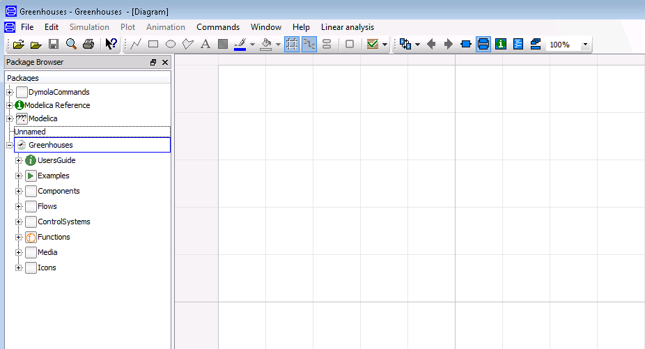
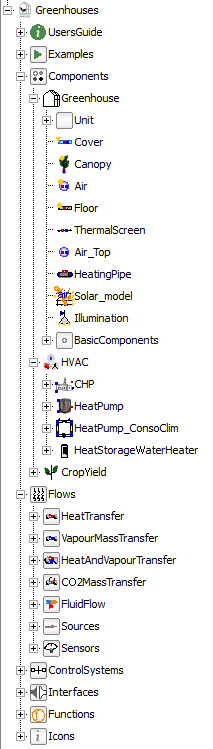
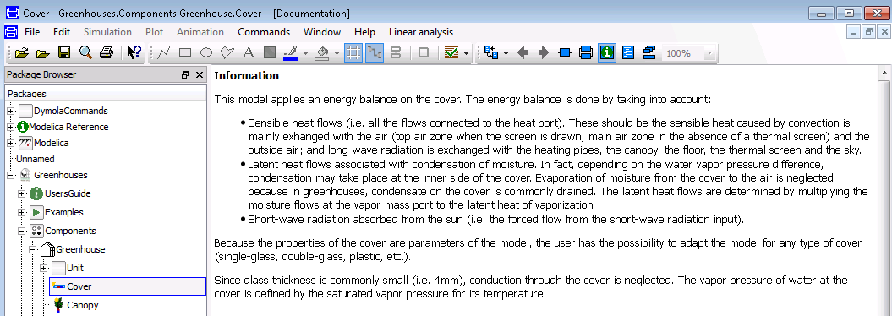
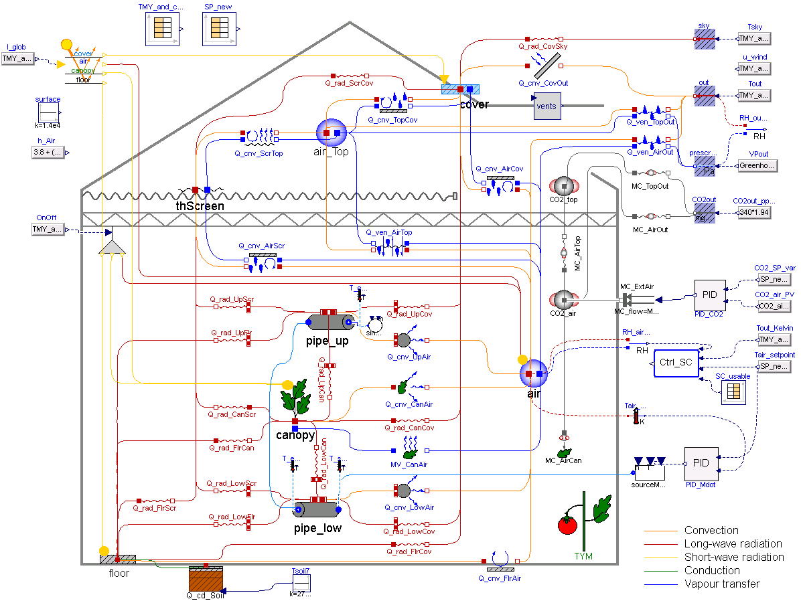

.. _overview:

Overview
========

A greenhouse climate model is a model that describes the indoor climate of a greenhouse
resulting from the greenhouse design, the outdoor climate and a specific control. In
greenhouses, the indoor climate is characterized by the temperature, the vapor pressure of
water (i.e. the relative humidity) and the |CO2| concentration of the air. Together with the
temperature of the heating pipes, the indoor climate constitutes the climate controller feed-
back quantities. However, in order to attain the desired climate, the variables with an indirect
influence on the climate also need to be modeled. These are mainly the characteristics relative
to the canopy and the envelope (i.e. the cover, the floor and the thermal screen). The canopy
temperature has an impact on its photosynthesis and transpiration, which decrease the |CO2|
concentration and increase the vapor content of the air, respectively. Evaporation or
condensation at surfaces may occur depending on the water vapor pressure difference with
respect to the air. The temperature of the envelope influences the vapor pressure of water of
the air, which is decreased by condensation at the cover and at the thermal screen. The
thermal screen is a membrane used to reduce the energy requirement to heat the greenhouse. Given the porous nature of the screen,
air and moisture is exchanged through its fabric. Air exchange with the outside decreases the
vapor pressure of water and the |CO2| concentration of the air, which can be increased by
supplementary |CO2| supply by an external source.

Greenhouse climate models have been the object of a substantial literature. While many
models have been developed (:cite:`bot_greenhouse_1983`, :cite:`de_zwart_analyzing_1996`, 
:cite:`impron_2007`, :cite:`luo_simulation_2005`,
:cite:`van_ooteghem_optimal_2010` ), most of them can only be used for a single location and for a
specific greenhouse structure and climate. Recently, a more generic greenhouse climate model
:cite:`vanthoor_methodology_2011_greenhouse` combining the work of :cite:`bot_greenhouse_1983` and :cite:`de_zwart_analyzing_1996` was developed. The model was validated for a range of climates and greenhouse designs. For the purpose of this
work, the model :cite:`vanthoor_methodology_2011_greenhouse` has been implemented in the Modelica language. It should
be noted that, when the screen is drawn, the air of the greenhouse is divided in two zones, i.e.
below and above the screen. These zones are modeled separately and their climate is assumed to be homogeneous.
In all the models of the library, the air zones below and above the thermal screen are going to be referred as main and
top air zones, respectively. 

.. figure:: figures/greenhousestatevariables.png
	:figclass: align-center
	:scale: 40%

Getting started
---------------
In this tutorial, the necessary steps to lead the correct packages to use Greenhouses with Dymola are reported.

1. Download the Greenhouses library from the `Greenhouses github repository`_.
2. Launch Dymola 2015 on your computer.
3. From the Dymola window, use the *Open* icon to browse to the Greenhouses folder and open the Greenhouses package.mo file.

.. figure:: figures/gettingstarted1.png
	:figclass: align-center

Dymola loads the Greenhouses library and the following will be displayed:

Congratulations! You have set the environment needed to use the Greenhouses library in Dymola 2015. You are now ready to simulate a wide range of greenhouse climates and thermal systems. Enjoy it!

Library structure
-----------------

The Greenhouses library is hierarchically structured into different packages, listed below:

* **Components** is the central part of the library. It is organized in three sub-packages: Greenhouse, HVAC and CropYield. It contains all the models available in the library from the simple greenhouse components (e.g. cover) to already-build greenhouse models ready to use; generation units models and a yield model for tomato crop.
* **Flows** contains models of the flows that are encountered in a greenhouse system. It is organized in eight sub-packages that model the heat, vapour mass and |CO2| mass transfer, as well as fluid flow. It also contains a sub-package of interfaces, which defined the type of connectors used in the library.
* **ControlSystems** contains the control units. It is organized in two sub-packages: climate control (i.e. the control of the thermal screen, artificial lighting and window's aperture) and HVAC control (i.e. the control of the operation of the generation units).
* **Examples** contains models where the components of the library can be tested. It includes the simulation of a greenhouse and two system-scale models that simulate the greenhouse connected to thermal energy storage, a CHP and a heat pump.
* **Interfaces** contains all the type of connectors used in the library.
* **Functions** are the empirical correlations used to characterize some of the models presents in the library.
* **Icons** defines the graphical interface for some of the models in the library.

The main packages are further divided into sub-packages and models. In Greenhouses, each model has a relative documentation explaining the main features. To access the documentation layer of each model you can click on the INFO icon on the Dymola menu.

Graphical user interface
------------------------

The developed modeling framework, being object-oriented, is made of independent sub-models for each
greenhouse component and exchanged flow, that are interconnected to build a greenhouse model. The sub-models interact together through
standard interfaces called ports. For modeling heat transfer and fluid flow, the heat transfer and the thermo-fluid flow connectors from the Modelica Standard Library are used. For moisture and |CO2| mass transfer, two connectors have been developed. An extra connector is developed for the short-wave radiation heat inputs. In total, five connectors are distinguished: 

- **Heat port**: from the Modelica Standard Library. Graphically represented by a red square, it is a thermal port for 1-dim heat transfer. Temperature (:math:`T` [K]) and heat flow rate (:math:`\dot{Q}` [W]) are the potential and flow variables, respectively.
- **Water mass port**: graphically represented by a blue square, it is a mass port for 1-dim moisture transfer. The vapor pressure of water (:math:`P_v` [Pa]) and the vapor mass flow rate (:math:`\dot{M}_v` [kg s⁻¹]) are the potential and flow variables, respectively.
- **CO**\ :sub:`2` \ **mass port**: graphically represented by a grey square, it is a mass port for 1-dim |CO2| mass transfer. The |CO2| concentration (:math:`CO2` [mg m⁻³]) and the |CO2| mass flow rate (:math:`\dot{m}_c` [mg m⁻² s⁻¹]) are the potential and flow variables, respectively.
- **Short-wave radiation connector**: graphically represented by a yellow triangle (single input) or circle (vector input), it is an input/output connector for forced radiation flows from the sun and supplementary lighting. The radiation flow (W m⁻²) is the potential variable.
- **Thermo-fluid port**: from the Modelica Standard Library. Graphically represented by a blue circle, it is an interface for quasi one-dimensional fluid flow in a piping network (incompressible or compressible, one or more phases, one or more substances). The connector is defined by the pressure and the mass flow rate as the potential and flow variables. Specific enthalpy and mass fractions are stream variables.

For more information on the definition of connectors, check the `Modelica users guide`_.

An example of greenhouse model is shown in the figure below. As it can be distinguished, the greenhouse modeled in this example consists of two levels of heating circuits, roof windows (but not side vents), natural ventilation (no forced ventilation) and a movable thermal screen. The majority of the flows distinguished in a greenhouse originate from convection at surfaces, ventilation processes, conduction at the soil and long-wave infrared radiation. Forced flows such as the short-wave radiation from the sun, latent heat flows or the sensible heat from supplementary lighting are also considered. 

.. |CO2| replace:: CO\ :sub:`2`

.. _Greenhouses github repository: https://github.com/queraltab/Greenhouses-Library
.. _ExternalMedia: https://github.com/modelica/ExternalMedia
.. _CoolProp: http://coolprop.sourceforge.net/
.. _modelica users guide: https://build.openmodelica.org/Documentation/Modelica.UsersGuide.Connectors.html
